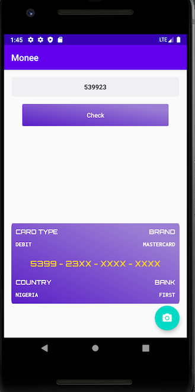

# Monee

Android application for getting the card details of a debit card from its first six digits. It communicates with the [binlist api](https://binlist.net/).

# Architecture
The app's architecture is MVVM and Clean architecture.

# Modularization

App is modularized by layers. The different modules in the app are remote, data, domain, presentation, app and core.

# Dependency Injection

App uses DaggerHilt for dependency injection.

# Error handling

Instead of having try/catch blocks everywhere, errors are handled and propagated functionally. 
I used a sealed class called ResultOrError for holding either an error or result from network calls.

# Concurrency and Multithreading

App uses coroutines to manage concurrency and multithreading.

# View States management.

The different view states are modelled as a sealed class and are propagated from the viewmodel to the views(Activity) using livedata.

# Tests

The remote, data, domain and presentation layers have unit tests.

# Static code analysis

App uses detekt and ktlint for static code analysis.

# Continuous Integration

Continuous integration is managed by CircleCI. It runs both the tests and detekt checks for each module in the app.

